# Markdown Org

[](https://github.com/VitalyOstanin/markdown-org-vscode/actions/workflows/ci.yml)
[](https://codecov.io/gh/VitalyOstanin/markdown-org-vscode)
[](https://open-vsx.org/extension/vitalyostanin/markdown-org-vscode)

Org-mode style task management in Markdown -- TODO/DONE workflow,
priorities, SCHEDULED/DEADLINE timestamps, day/week/month agenda views,
CLOCK time tracking, and **one-way [Google Calendar sync](#google-calendar-sync)**
of scheduled tasks. Everything lives in plain `.md` files, so your tasks
travel with the repository.

<picture>
    <source media="(prefers-color-scheme: dark)" srcset="https://github.com/VitalyOstanin/markdown-org-vscode/raw/HEAD/media/demo-agenda-dark.gif">
    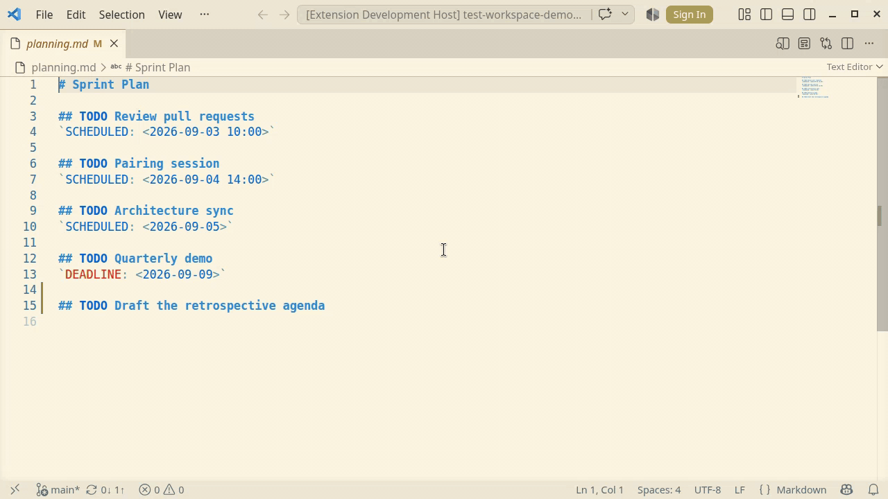
</picture>

## Table of Contents

- [Features](#features)
    - [Google Calendar sync (new)](#google-calendar-sync-new)
    - [Core](#core)
- [Quick Start](#quick-start)
- [Syntax Examples](#syntax-examples)
    - [Task Statuses](#task-statuses)
    - [Timestamps](#timestamps)
        - [Active and inactive forms](#active-and-inactive-forms)
    - [CLOCK Entries](#clock-entries)
    - [Priority Levels](#priority-levels)
    - [Repeating Tasks](#repeating-tasks)
- [Commands](#commands)
    - [Task Status Commands](#task-status-commands)
    - [Timestamp Commands](#timestamp-commands)
    - [CLOCK Commands](#clock-commands)
    - [Agenda Commands](#agenda-commands)
    - [Shadowed VS Code chords](#shadowed-vs-code-chords)
    - [Heading Management Commands](#heading-management-commands)
        - [Migrating into a maintain file with **Promote to Maintain**](#migrating-into-a-maintain-file-with-promote-to-maintain)
    - [Google Calendar Commands](#google-calendar-commands)
- [Settings](#settings)
    - [`markdown-org.extractorPath`](#markdown-orgextractorpath)
    - [`markdown-org.workspaceDir`](#markdown-orgworkspacedir)
    - [`markdown-org.maintainFilePath`](#markdown-orgmaintainfilepath)
    - [`markdown-org.dateLocale`](#markdown-orgdatelocale)
    - [`markdown-org.uiLanguage`](#markdown-orguilanguage)
    - [`markdown-org.firstDayOfWeek`](#markdown-orgfirstdayofweek)
    - [`markdown-org.fileTags`](#markdown-orgfiletags)
    - [`markdown-org.currentTag`](#markdown-orgcurrenttag)
    - [`markdown-org.agendaFontFamily`](#markdown-orgagendafontfamily)
    - [`markdown-org.agendaHeaderMode`](#markdown-orgagendaheadermode)
    - [`markdown-org.clockRoundMinutes`](#markdown-orgclockroundminutes)
    - [`markdown-org.weekdayLocale`](#markdown-orgweekdaylocale)
    - [`markdown-org.gcalSync.clientId`](#markdown-orggcalsyncclientid)
- [Workspace Trust](#workspace-trust)
- [Google Calendar Sync](#google-calendar-sync)
- [Dependencies](#dependencies)
- [Development](#development)
- [Release notes](#release-notes)
- [License](#license)

## Features

Brings the [Org mode](https://orgmode.org/) task management workflow
to Markdown files in VS Code.

### Google Calendar sync (new)

**Opt-in, one-way push of `SCHEDULED` / `DEADLINE` tasks to your own
Google Calendar.** Connect with your OAuth Desktop client (refresh
token stays in the OS keychain via VS Code's `SecretStorage`), pick the
target calendar, then **Sync Now** on demand or enable debounced
**sync on save**. Marking a task DONE deletes its event (configurable);
re-opening it (DONE → TODO) revives the event instead of leaving an
orphan. Property write-back (`ID` / `GCAL_EVENT_ID`) is conflict-safe.
See the full [Google Calendar Sync](#google-calendar-sync) section with
connect / select / sync demos and [ADR-0010](docs/adr/0010-google-calendar-sync.md).

<picture>
    <source media="(prefers-color-scheme: dark)" srcset="https://github.com/VitalyOstanin/markdown-org-vscode/raw/HEAD/media/demo-gcal-sync-dark.gif">
    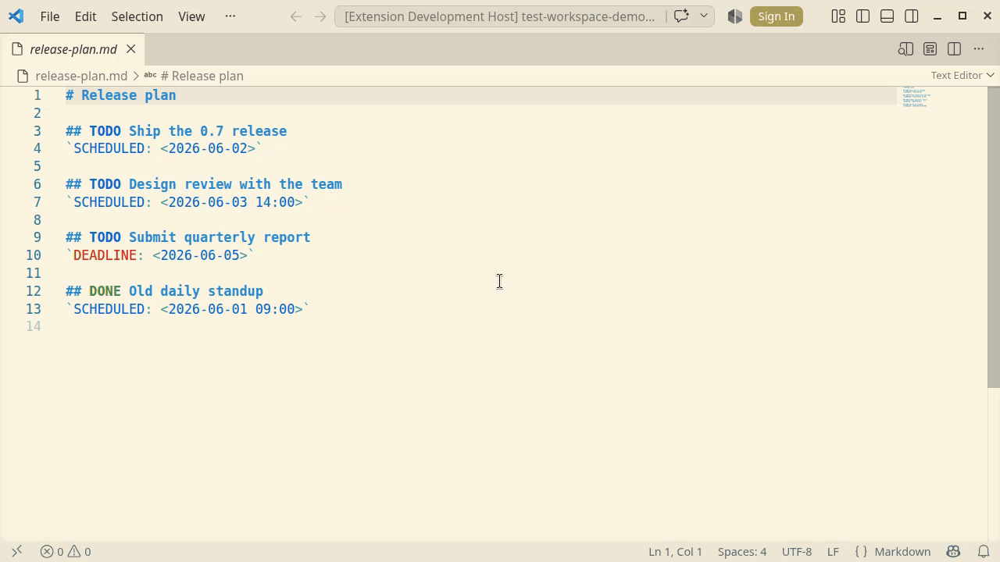
</picture>

### Core

- **Task management** -- TODO / DONE / CANCELLED statuses with priorities (`[#A]` -- `[#Z]` or numeric `[#0]` -- `[#64]`). A CANCELLED task (both spellings `CANCELLED` and `CANCELED` are recognised) renders struck-through in the agenda and is excluded from Google Calendar sync -- its event is deleted if it had one.
- **Timestamps** -- `CREATED`, `SCHEDULED`, `DEADLINE`, `CLOSED` with full date / time, in both active `<...>` and inactive `[...]` forms per [ADR-0005](docs/adr/0005-active-and-inactive-timestamps.md).
- **Repeating tasks** -- Org-mode repeaters `+1d`, `+1w`, `+1m`, `.+1m`, `++1w`, and `+1wd` for workdays (skips weekends and Russian holidays).
- **CLOCK entries** -- Time tracking with start / finish events and an aggregated CLOCK table per file.
- **Agenda views** -- Day, Week, Month and Tasks. Day and Tasks are cards (a sticky summary bar plus sections by time of day or by priority), the week groups overdue, scheduled and upcoming tasks under sticky day headers, and the month calendar shows a per-day task count that turns red when a day holds something overdue. Views keep a browser-style history you can step through with the Back / Forward commands.
- **Interface language** -- The agenda panel speaks English or Russian, following [`markdown-org.uiLanguage`](#markdown-orguilanguage); by default it follows the date locale, then the VS Code display language.
- **Tag filtering** -- Filter agenda by file-name patterns (e.g. `WORK` / `PRIVATE`), toggled from the agenda or by hotkey.
- **Git status of the source files** -- A chip in the agenda header counts the files of the current view that have uncommitted changes and the files touched by unpushed commits, and expands to the list behind those numbers. Commit (only the view's changed files, never unrelated edits in the same repository) and push run from the same dropdown. Files reached through a symlink resolve to the repository behind them, including one outside the open workspace folders. Needs no setting and no configuration: the chip appears when the built-in Git extension is available and the files are tracked. See [ADR-0016](docs/adr/0016-git-status-via-git-extension-api.md).
- **Live updates** -- Agenda refreshes automatically when underlying markdown files change.
- **Heading management** -- Archive completed tasks to `*.archive.md` or promote them to a maintenance file.
- **Properties** -- A per-task properties block: a fenced code block with the info string `org-properties` holding `KEY: value` lines, placed under the heading and its planning lines. It round-trips through markdown viewers as a folded block. See [ADR-0009](docs/adr/0009-task-properties-org-properties-block.md).

## Quick Start

The extension bundles a prebuilt `markdown-org-extract` binary inside
the VSIX, so there is nothing to install separately. Pick the install
channel that matches your editor:

- **VSCodium / Cursor / Gitpod / code-server (Open VSX registry):**

    ```bash
    code --install-extension vitalyostanin.markdown-org-vscode
    ```

    Or browse the extension page on
    [Open VSX](https://open-vsx.org/extension/vitalyostanin/markdown-org-vscode).

- **VS Code (Microsoft Marketplace is intentionally not used -- see
  [ADR-0004](docs/adr/0004-open-vsx-distribution.md)):** download the
  platform-specific `markdown-org-vscode-X.Y.Z-<platform>.vsix` from
  [GitHub Releases](https://github.com/VitalyOstanin/markdown-org-vscode/releases)
  (e.g. `linux-x64`, `darwin-arm64`, `win32-x64`) and install it:
    - **GUI:** open the **Extensions** view (`Ctrl+Shift+X`), click the
      `...` menu next to the search box, choose **Install from VSIX...**,
      and select the downloaded file.
    - **CLI:**

        ```bash
        code --install-extension markdown-org-vscode-X.Y.Z-<platform>.vsix
        ```

Open any `.md` file in your workspace and start using the
[commands](#commands). For building the extension from source or
running with a custom `markdown-org-extract` build, see
[DEVELOPMENT.md](DEVELOPMENT.md) and
[`markdown-org.extractorPath`](#markdown-orgextractorpath).

## Syntax Examples

The extension reads tasks directly from your Markdown -- headings
become tasks, inline code spans hold timestamps:

<picture>
    <source media="(prefers-color-scheme: dark)" srcset="https://github.com/VitalyOstanin/markdown-org-vscode/raw/HEAD/media/editor-markdown-dark.png">
    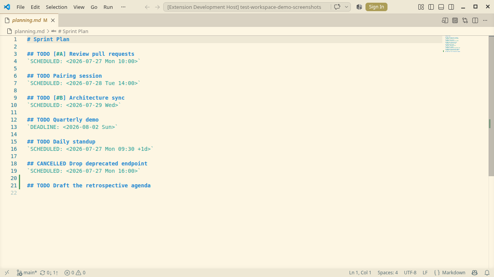
</picture>

### Task Statuses

<picture>
    <source media="(prefers-color-scheme: dark)" srcset="https://github.com/VitalyOstanin/markdown-org-vscode/raw/HEAD/media/demo-task-status-dark.gif">
    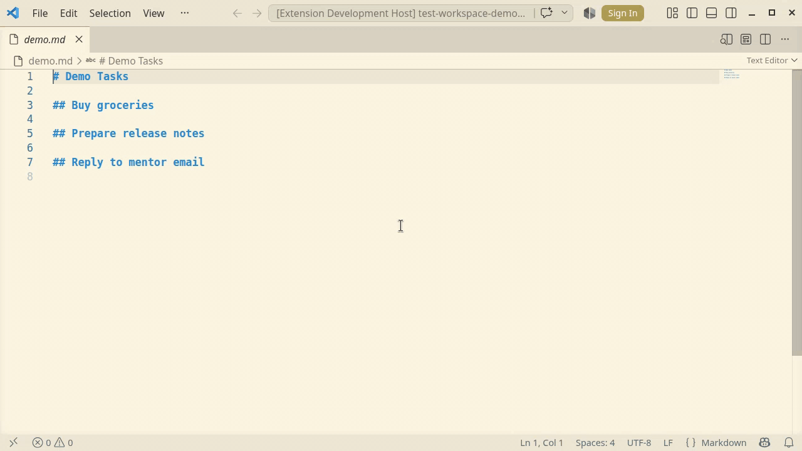
</picture>

```markdown
## TODO Task without priority

## TODO [#A] High priority task

## DONE Completed task

## CANCELLED Abandoned task

## Regular heading without status
```

Both spellings of the cancelled keyword are recognised on read --
`CANCELLED` (the common convention) and `CANCELED` (the Org manual's
single-`L` form); `Set CANCELLED` writes `CANCELLED`. A cancelled task is
shown struck-through in the agenda and is never pushed to Google Calendar
(any event it already had is deleted).

### Timestamps

<picture>
    <source media="(prefers-color-scheme: dark)" srcset="https://github.com/VitalyOstanin/markdown-org-vscode/raw/HEAD/media/demo-timestamps-dark.gif">
    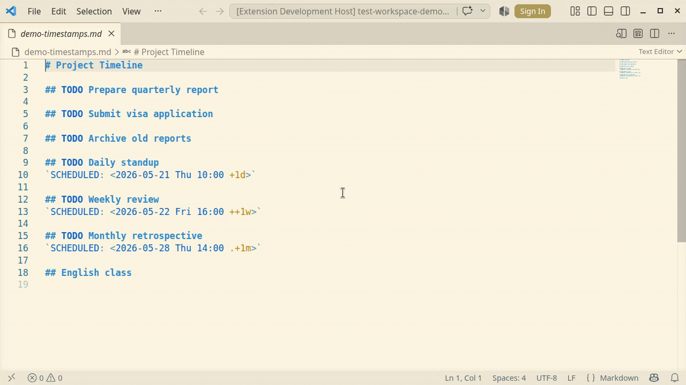
</picture>

**With tasks:**

```markdown
## TODO [#A] Important meeting
`CREATED: [2025-12-01 Sun 09:15]`
`DEADLINE: <2025-12-06 Fri 15:00>`
```

**Completed task:**

```markdown
## DONE Fix bug in parser
`CREATED: [2025-12-01 Sun 10:00]`
`CLOSED: [2025-12-03 Tue 14:30]`
```

**Without tasks (standalone timestamps):**

```markdown
## Project planning session
`SCHEDULED: <2025-12-10 Tue 10:00>`

## Report submission
`DEADLINE: <2025-12-15 Sun>`
```

#### Active and inactive forms

Org-mode distinguishes two bracket forms for timestamps; the editor
follows the per-keyword policy defined in
[ADR-0005](docs/adr/0005-active-and-inactive-timestamps.md):

| Keyword      | Bracket form       | Rationale                                                                 |
| ------------ | ------------------ | ------------------------------------------------------------------------- |
| `SCHEDULED:` | `<...>`            | Drives agenda windows; must be active.                                    |
| `DEADLINE:`  | `<...>`            | Drives agenda windows; must be active.                                    |
| `CLOSED:`    | `[...]`            | Descriptive completion stamp; matches Emacs `org-todo`.                   |
| `CREATED:`   | `[...]`            | Descriptive metadata; matches Emacs `org-expiry`.                         |
| Inline plain | `<...>` or `[...]` | Either form; active is agenda-relevant, inactive is descriptive metadata. |
| `CLOCK:`     | `<...>` or `[...]` | Either form is accepted on read; the editor writes `[...]`.               |

A keyword line whose bracket form does not match the table -- for
example `CLOSED: <2025-12-03 Tue>` or a mixed pair like
`<2025-12-03 Tue]` -- is surfaced as a warning under the
`markdown-org` diagnostic source. Press `Ctrl+.` on the warning to
apply the **Convert to canonical bracket form** Quick Fix.

To flip a bare inline timestamp between `<...>` and `[...]`, run
`Markdown Org: Toggle Timestamp Active/Inactive` from the Command
Palette. The command refuses on keyword lines (the keyword binds the
bracket form); use `Shift+Up` / `Shift+Down` to cycle the keyword
instead. See [ADR-0006](docs/adr/0006-bracket-toggle-keybindings.md)
for the UX rationale and the deliberate asymmetry with Emacs
`org-toggle-timestamp-type`.

### CLOCK Entries

CLOCK entries track time spent on tasks. They can be open (running)
or closed (with duration).

<picture>
    <source media="(prefers-color-scheme: dark)" srcset="https://github.com/VitalyOstanin/markdown-org-vscode/raw/HEAD/media/demo-clock-dark.gif">
    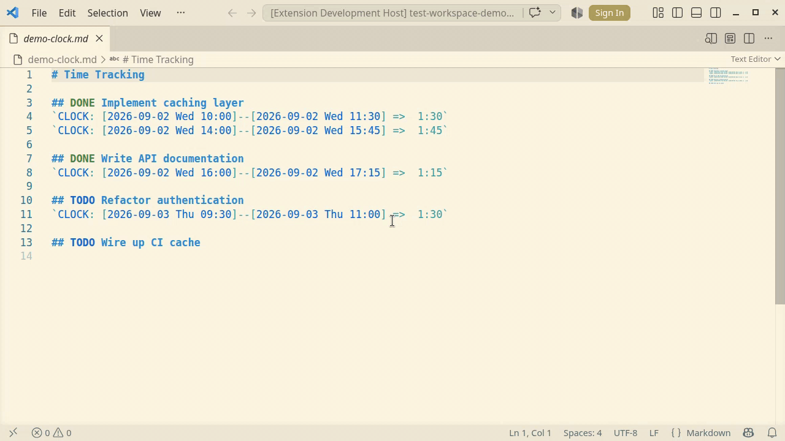
</picture>

**Open CLOCK (running):**

```markdown
## TODO Working on feature
`CREATED: [2025-12-09 Tue 10:00]`
`CLOCK: [2025-12-09 Tue 14:30]`
```

**Closed CLOCK (with duration):**

```markdown
## TODO Code review
`CREATED: [2025-12-09 Tue 09:00]`
`CLOCK: [2025-12-09 Tue 10:00]--[2025-12-09 Tue 11:30] =>  1:30`
`CLOCK: [2025-12-09 Tue 14:00]--[2025-12-09 Tue 16:00] =>  2:00`
```

Use **Insert CLOCK Table** to produce an aggregated table of CLOCK
durations for the current file:

<picture>
    <source media="(prefers-color-scheme: dark)" srcset="https://github.com/VitalyOstanin/markdown-org-vscode/raw/HEAD/media/clocktable-dark.png">
    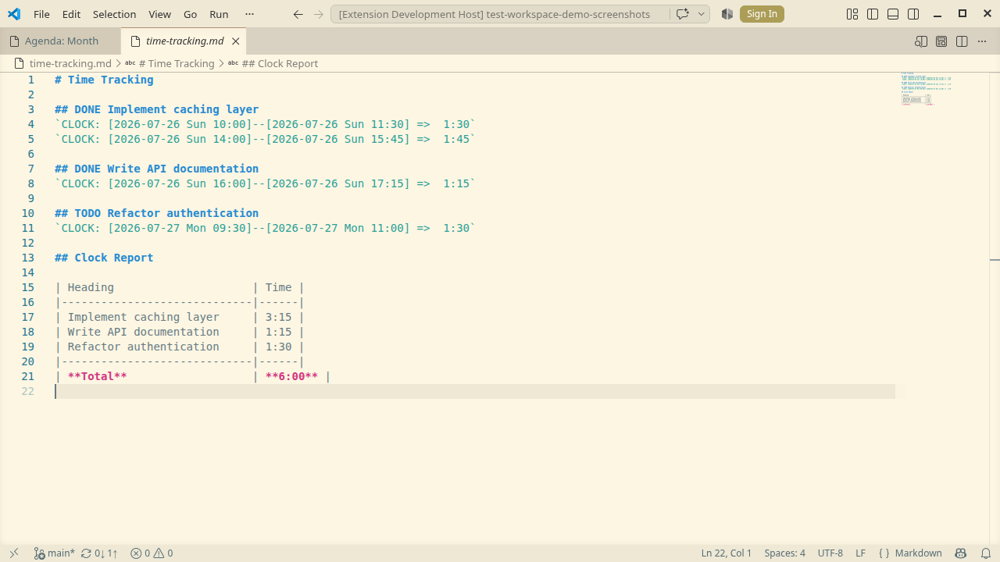
</picture>

### Priority Levels

Priority markers can be either a letter `A` -- `Z` or a number
`0` -- `64`:

```markdown
## TODO [#A] High priority task

## TODO [#B] Medium priority task

## TODO [#C] Low priority task

## TODO [#0] Highest numeric priority

## TODO [#64] Lowest numeric priority
```

Tasks with priority are shown first in the agenda, sorted ascending
(A before B before C; 0 before 1 before 2).

### Repeating Tasks

Timestamps support Org-mode repeater syntax for recurring tasks. The
weekday and repeater always live **inside** the angle brackets.

**Standard units:**

| Repeater | Meaning                                             |
| -------- | --------------------------------------------------- |
| `+Nh`    | Every N hours (see the note below)                  |
| `+Nd`    | Every N days                                        |
| `+Nw`    | Every N weeks                                       |
| `+Nm`    | Every N months                                      |
| `+Ny`    | Every N years                                       |
| `+Nwd`   | Every N **workdays** (skips weekends + RU holidays) |

**Hourly repeaters in the agenda.** The agenda is a day grid, so
`markdown-org-extract` projects an hour repeater onto it: every day counts as
one occurrence and **N is ignored** -- `+5h` behaves like `+1h`. Google Calendar
sync is not bound by that grid and maps the same repeater to
`FREQ=HOURLY;INTERVAL=N`.

**Repeater modifiers:**

| Prefix | Behaviour                                |
| ------ | ---------------------------------------- |
| `+`    | Cumulative (strict) -- preserves overdue |
| `++`   | Catch-up -- preserves day of week        |
| `.+`   | Restart -- counts from completion date   |

**Examples:**

```markdown
## TODO Daily standup
`SCHEDULED: <2026-12-06 Sun 10:00 +1d>`

## TODO Weekly review
`SCHEDULED: <2026-12-06 Sun ++1w>`

## TODO Every 2 workdays
`SCHEDULED: <2026-12-06 Sun +2wd>`
```

## Commands

Hotkeys below match the bindings declared in `package.json`. They are
active while a Markdown editor has focus, with three exceptions: the
four `Show Agenda …` / `Show Tasks` commands also work while the agenda
panel has focus, the agenda history commands work only there, and
`Cycle Tag Filter` works everywhere.

On macOS every `Ctrl+K …` chord uses `Cmd` instead, e.g. `Cmd+K Cmd+T`
for `Set TODO` (the `Shift+Up`/`Shift+Down` bindings are unchanged).

### Task Status Commands

| Command                         | Hotkey          | Description                                 |
| ------------------------------- | --------------- | ------------------------------------------- |
| `Markdown Org: Set TODO`        | `Ctrl+K Ctrl+T` | Mark heading as TODO                        |
| `Markdown Org: Set DONE`        | `Ctrl+K Ctrl+D` | Mark heading as DONE                        |
| `Markdown Org: Set CANCELLED`   | `Ctrl+K Ctrl+X` | Mark heading as CANCELLED (repeat to clear) |
| `Markdown Org: Toggle Priority` | `Ctrl+K Ctrl+P` | Toggle priority: none → [#A] → none         |

### Timestamp Commands

| Command                                          | Hotkey                 | Description                                                                                                                                            |
| ------------------------------------------------ | ---------------------- | ------------------------------------------------------------------------------------------------------------------------------------------------------ |
| `Markdown Org: Insert CREATED Timestamp`         | `Ctrl+K Ctrl+K Ctrl+C` | Insert CREATED timestamp under the heading (inactive `[...]` form)                                                                                     |
| `Markdown Org: Insert SCHEDULED Timestamp`       | `Ctrl+K Ctrl+K Ctrl+S` | Insert SCHEDULED timestamp; repeating the command removes it (toggle off)                                                                              |
| `Markdown Org: Insert DEADLINE Timestamp`        | `Ctrl+K Ctrl+K Ctrl+D` | Insert DEADLINE timestamp; repeating the command removes it (toggle off)                                                                               |
| `Markdown Org: Timestamp Up`                     | `Shift+Up`             | Increment date / time / task status / timestamp type under cursor; with a non-adjustable caret or an active selection, extends the selection as usual  |
| `Markdown Org: Timestamp Down`                   | `Shift+Down`           | Decrement date / time / task status / timestamp type under cursor; with a non-adjustable caret or an active selection, extends the selection as usual  |
| `Markdown Org: Toggle Timestamp Active/Inactive` | -                      | Flip `<...>` ↔ `[...]` on a bare inline timestamp under the cursor (Command Palette only; see [ADR-0006](docs/adr/0006-bracket-toggle-keybindings.md)) |

### CLOCK Commands

| Command                             | Hotkey                 | Description                                           |
| ----------------------------------- | ---------------------- | ----------------------------------------------------- |
| `Markdown Org: Insert CLOCK Start`  | `Ctrl+K Ctrl+C Ctrl+S` | Start a new CLOCK entry (opens timer)                 |
| `Markdown Org: Insert CLOCK Finish` | `Ctrl+K Ctrl+C Ctrl+F` | Close the open CLOCK entry and calculate its duration |
| `Markdown Org: Insert CLOCK Table`  | `Ctrl+K Ctrl+C Ctrl+V` | Insert an aggregated CLOCK table for the current file |

### Agenda Commands

| Command                                    | Hotkey                 | Description                                              |
| ------------------------------------------ | ---------------------- | -------------------------------------------------------- |
| `Markdown Org: Show Agenda (Day)`          | `Ctrl+K Ctrl+K Ctrl+Y` | Show today's tasks                                       |
| `Markdown Org: Show Agenda (Week)`         | `Ctrl+K Ctrl+W`        | Show this week's tasks                                   |
| `Markdown Org: Show Agenda (Month)`        | `Ctrl+K Ctrl+M`        | Show this month's tasks                                  |
| `Markdown Org: Show Tasks`                 | `Ctrl+K Ctrl+K Ctrl+L` | Show all TODO tasks grouped by priority                  |
| `Markdown Org: Go Back in Agenda`          | `Alt+Shift+-`          | Return to the previously shown agenda view               |
| `Markdown Org: Go Forward in Agenda`       | `Alt+Shift+=`          | Step forward again after going back                      |
| `Markdown Org: Cycle Tag Filter`           | `Ctrl+K Ctrl+K Ctrl+T` | Cycle the active file tag filter (e.g. ALL/WORK/PRIVATE) |
| `Markdown Org: Cycle Agenda Header Layout` | --                     | Step the header layout: auto -> full -> compact          |

All four view commands work both in a Markdown editor and while the agenda panel has focus, so you can switch views from the panel with the keyboard as well as with the mode buttons.

The agenda keeps a browser-style history of the views you opened (mode plus anchor date). Back and Forward replay it. They have no buttons in the header -- the two commands above are the way to reach them; their hotkeys apply while the agenda panel has focus and can be rebound like any other keybinding.

**Day view:**

<picture>
    <source media="(prefers-color-scheme: dark)" srcset="https://github.com/VitalyOstanin/markdown-org-vscode/raw/HEAD/media/agenda-day-dark.png">
    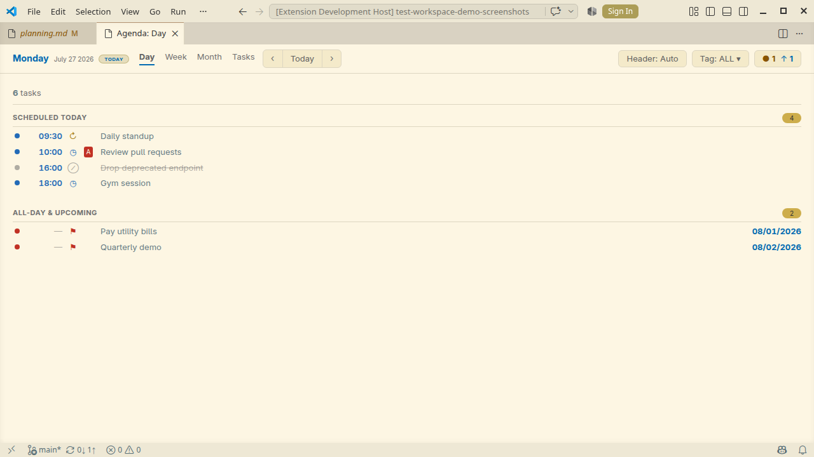
</picture>

**Week view:**

<picture>
    <source media="(prefers-color-scheme: dark)" srcset="https://github.com/VitalyOstanin/markdown-org-vscode/raw/HEAD/media/agenda-week-dark.png">
    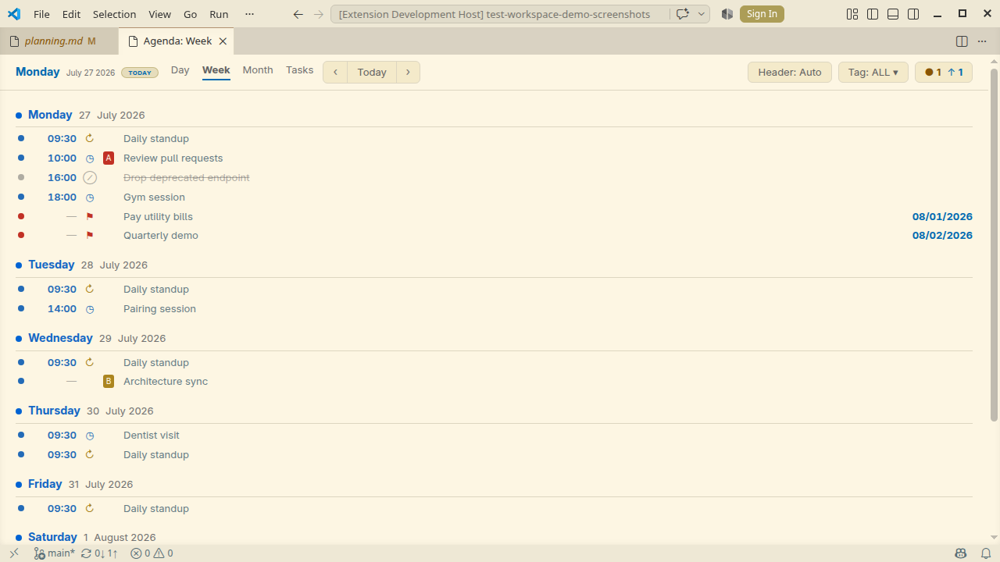
</picture>

**Month view:**

<picture>
    <source media="(prefers-color-scheme: dark)" srcset="https://github.com/VitalyOstanin/markdown-org-vscode/raw/HEAD/media/agenda-month-dark.png">
    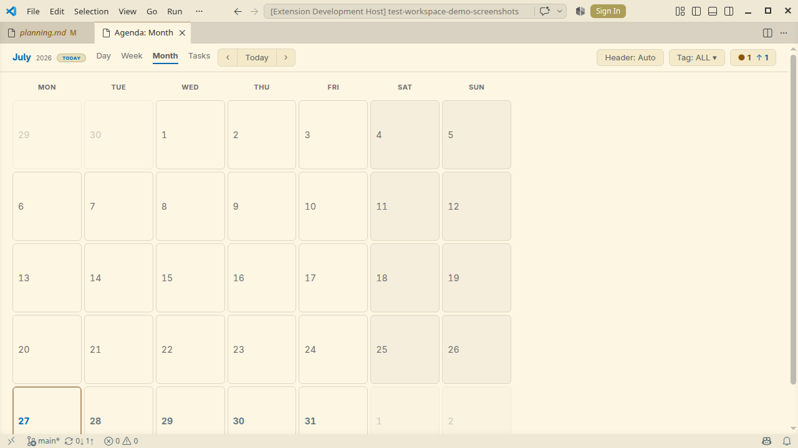
</picture>

**Git status of the source files:** the chip on the right of the header counts the files behind the current view that carry uncommitted changes (`●`) and the files touched by commits the remote does not have (`↑`). Expanding it names those files, groups them by state, and offers the two actions for the view's own files -- committing them without touching unrelated edits in the same repository, and pushing the branch.

<picture>
    <source media="(prefers-color-scheme: dark)" srcset="https://github.com/VitalyOstanin/markdown-org-vscode/raw/HEAD/media/agenda-git-dark.png">
    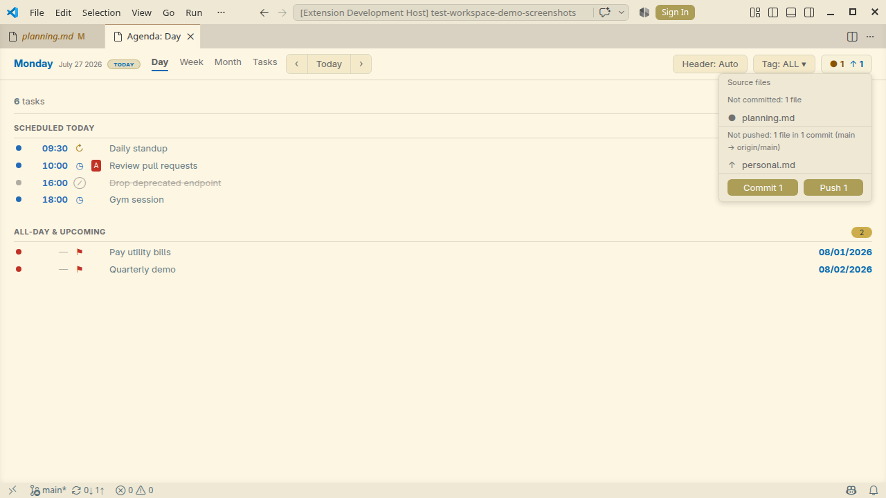
</picture>

### Shadowed VS Code chords

The extension's `Ctrl+K …` chords deliberately take precedence over the VS Code defaults listed
below. The override applies where the `when` clause of each binding does -- in Markdown files, and
for the four view commands also in the agenda panel -- and, with the one exception noted under the
table, nowhere else: in any other editor the default command keeps working. Rebind either side in
**Keyboard Shortcuts** if you prefer the default.

| Chord                  | Extension command                | VS Code default it shadows             |
| ---------------------- | -------------------------------- | -------------------------------------- |
| `Ctrl+K Ctrl+T`        | Set TODO                         | Select Color Theme                     |
| `Ctrl+K Ctrl+D`        | Set DONE                         | Move Last Selection To Next Find Match |
| `Ctrl+K Ctrl+X`        | Set CANCELLED                    | Trim Trailing Whitespace               |
| `Ctrl+K Ctrl+P`        | Toggle Priority                  | Show All Editors By Appearance         |
| `Ctrl+K Ctrl+C Ctrl+…` | Insert CLOCK Start/Finish/Table  | Add Line Comment (`Ctrl+K Ctrl+C`)     |
| `Ctrl+K Ctrl+W`        | Show Agenda (Week)               | Close All Editors                      |
| `Ctrl+K Ctrl+M`        | Show Agenda (Month)              | Toggle Maximize Editor Group           |
| `Ctrl+K Ctrl+K Ctrl+…` | Timestamps, views, headings, tag | Select from Anchor to Cursor           |

Two of these are easy to misread. `Copy Path of Active File` is `Ctrl+K P` (no second `Ctrl`) and
`Change Language Mode` is `Ctrl+K M`, so neither is affected.

The CLOCK and `Ctrl+K Ctrl+K` entries differ from the rest: both are prefixes here, so in a
Markdown file the editor waits for the next chord instead of running the default command.

One binding under that prefix is global: `Cycle Tag Filter` (`Ctrl+K Ctrl+K Ctrl+T`) carries no
`when` clause, so it takes the prefix in every editor, not only in Markdown files. That is
deliberate -- the tag filter applies to the agenda, which is not tied to the file you are in.

### Heading Management Commands

| Command                             | Hotkey                        | Description                                                                  |
| ----------------------------------- | ----------------------------- | ---------------------------------------------------------------------------- |
| `Markdown Org: Move to Archive`     | `Ctrl+K Ctrl+K Ctrl+M Ctrl+A` | Move current heading into the file's `*.archive.md`                          |
| `Markdown Org: Promote to Maintain` | `Ctrl+K Ctrl+K Ctrl+M Ctrl+P` | Move heading to the maintain file (requires `markdown-org.maintainFilePath`) |

#### Migrating into a maintain file with **Promote to Maintain**

`Promote to Maintain` was built for a specific workflow: gradually migrating
tasks from an older planner into a single, current markdown file. Use cases
include moving entries out of a legacy org-mode `todo.org`, consolidating
several scratch `.md` files into one, or triaging an export from a tracker
that arrives as headings.

Set `markdown-org.maintainFilePath` to the target file (relative to the
workspace root). Place the cursor on any markdown heading and trigger the
command. The heading -- with its body and any child headings -- is cut
from the active document and appended to the maintain file under a
`# incoming` section. Behaviour in detail:

- The promoted heading is rewritten as a level-2 (`## `) heading
  regardless of its original level, so promoted blocks share a single
  inbox layout no matter where they came from.
- Child headings shift by `delta = 2 - <source level>` and are clamped
  to `[1, 6]`: an `### Subtask` under a `## ` source keeps `###`; an
  `## Subtask` under a `# ` source becomes `###`; an already-`######`
  child stays `######`.
- The first `# incoming` heading in the maintain file (case-insensitive
  match) is reused; the block is spliced in directly after it. If the
  file has no `# incoming`, the section is appended at the bottom; if
  the file does not exist yet, it is created.
- The maintain write is atomic (write to `*.tmp-<pid>-<ts>` + rename) and
  refuses to follow a symlink at the maintain path. The source document
  edit is applied through `vscode.WorkspaceEdit` -- the source remains
  open and unsaved until the user saves it, so the cut can be reviewed
  or undone.
- The command is disabled in untrusted workspaces and refuses paths
  outside the workspace, in line with the rest of the extension.

### Google Calendar Commands

| Command                                    | Hotkey | Description                                                                                                                               |
| ------------------------------------------ | ------ | ----------------------------------------------------------------------------------------------------------------------------------------- |
| `Markdown Org: Connect Google Calendar`    | -      | Authorize sync: pick a GNOME Online Accounts Google account (Linux) or run the BYO OAuth flow and store the refresh token in the keychain |
| `Markdown Org: Disconnect Google Calendar` | -      | Remove the stored token and client secret from the keychain                                                                               |
| `Markdown Org: Select Google Calendar`     | -      | Pick the calendar to sync into; pins `gcalSync.calendarId`                                                                                |
| `Markdown Org: Sync Now (Google Calendar)` | -      | Push tasks to Google Calendar once, on demand                                                                                             |

See [Google Calendar Sync](#google-calendar-sync) for the one-time setup.

## Settings

### `markdown-org.extractorPath`

**Type:** `string`
**Default:** `""` (use bundled binary)

Path to the markdown-org-extract executable.

- **Empty (default):** the extension uses the binary bundled inside the
  VSIX (`bin/markdown-org-extract[.exe]`). Falls back to looking up
  `markdown-org-extract` in `PATH` if the bundled file is missing
  (e.g. during local development without a prepared `bin/`).
- **Custom value:** overrides the bundled binary. Useful when
  contributing to markdown-org-extract or running with local patches.

```json
{
    "markdown-org.extractorPath": "/path/to/my/markdown-org-extract"
}
```

> **Security:** the configured path is executed by the extension every
> time agenda or related commands run. Only override the bundled
> binary with one you trust -- ideally installed via
> `cargo install markdown-org-extract` from
> [crates.io](https://crates.io/crates/markdown-org-extract), or built
> from a source tree you control. Do not point it at downloaded
> executables of unknown origin, files in world-writable locations
> (`/tmp`, shared caches), or scripts that wrap the extractor with
> extra side effects. In untrusted workspaces VS Code automatically
> refuses to honour this setting (see `capabilities.untrustedWorkspaces`
> in `package.json`).

### `markdown-org.workspaceDir`

**Type:** `string`
**Default:** `""` (workspace root)

Directory to scan for markdown files. Empty value uses workspace root.

### `markdown-org.maintainFilePath`

**Type:** `string`
**Default:** `""` (disabled)

Path to the maintain file for the "Promote to Maintain" command. Relative paths are resolved against the workspace root; the path must stay inside the workspace.

```json
{
    "markdown-org.maintainFilePath": "docs/maintain.md"
}
```

### `markdown-org.dateLocale`

**Type:** `string`
**Default:** `"en-US"`

Locale for date formatting in agenda views.

```json
{
    "markdown-org.dateLocale": "ru-RU"
}
```

### `markdown-org.uiLanguage`

**Type:** `"auto" | "en" | "ru"`
**Default:** `"auto"`

Language of the agenda interface: mode buttons, navigation, section and group titles, summary counts, and tooltips. Dates themselves follow [`markdown-org.dateLocale`](#markdown-orgdatelocale).

`"auto"` resolves the language from `markdown-org.dateLocale` first (only when you set that setting yourself), then from the VS Code display language, then falls back to English -- so setting the date locale to `ru-RU` also switches the interface to Russian, and a Russian VS Code gives a Russian agenda even with the date locale untouched. Set the value explicitly to keep the two apart (for example Russian dates with an English interface).

The setting covers what the agenda panel itself renders. Three things stay in English regardless of it: notifications the extension raises through VS Code (error toasts, warnings, status-bar messages), the command names in the Command Palette, and the setting titles and descriptions on this page and in the Settings UI. All three come from the extension manifest or from VS Code's own message API, neither of which reads this setting.

```json
{
    "markdown-org.uiLanguage": "ru"
}
```

The setting is read on every agenda render, so an open panel follows a change on the next refresh. Command names are supplied by the extension manifest, which ships English strings only (see [ADR-0013](docs/adr/0013-agenda-ui-language-own-dictionary.md)).

### `markdown-org.firstDayOfWeek`

**Type:** `"monday" | "sunday" | "auto"`
**Default:** `"monday"`

First day of week in the month calendar. `"auto"` resolves the first day from the locale via `Intl.Locale.weekInfo`, falling back to `"monday"` when the API is unavailable.

```json
{
    "markdown-org.firstDayOfWeek": "auto"
}
```

### `markdown-org.fileTags`

**Type:** `{ name: string; pattern: string }[]`
**Default:** `[{ "name": "ALL", "pattern": "" }, { "name": "WORK", "pattern": "work" }, { "name": "PRIVATE", "pattern": "!work" }]`

File tag filters applied in agenda. `pattern` is a case-sensitive substring matched against the file's **basename** (not the full path), so a pattern like `"work"` does not accidentally match files inside a `networking/` directory.

- `""` (empty) -- filter disabled; all tasks are shown. The tag's name has no special meaning.
- `"text"` -- basename contains `"text"`.
- `"!..."` -- basename matches **none** of the positive patterns in `fileTags`. The text after `!` is only a marker and is ignored, so `"!"`, `"!work"`, and `"!xyz"` all behave the same way.

See [TAG_FILTERING.md](TAG_FILTERING.md) for examples. Cycle the active tag with `Cycle Tag Filter`.

### `markdown-org.currentTag`

**Type:** `string`
**Default:** `"ALL"`

Currently selected tag filter. Usually updated by `Cycle Tag Filter`. Stored at workspace scope when a workspace is open, otherwise globally.

### `markdown-org.agendaFontFamily`

**Type:** `string`
**Default:** `""` (system UI font stack)

Proportional font family of the agenda webview, given as a CSS font stack (e.g. `"Fira Sans", system-ui, sans-serif`). Empty uses `'Adwaita Sans', 'Noto Sans', system-ui, sans-serif`. Numeric columns (time, offsets) render in the same face with `tabular-nums`, so they still line up.

The value goes into a stylesheet, so it is checked first: only letters, digits, spaces, quotes, commas, dots, hyphens and underscores are accepted. Anything else — CSS functions such as `url(...)`, comments, braces, semicolons — is ignored and the default stack is used instead. Changing the setting re-renders an open agenda; no reopen needed.

All agenda colors are driven by VS Code theme tokens, so the panel follows the active light / dark / high-contrast theme.

### `markdown-org.agendaHeaderMode`

**Type:** `"auto" | "full" | "compact"`
**Default:** `"auto"`

Layout of the agenda header. The full header takes about a fifth of a short panel: a control row plus a hero line carrying a large weekday or month title. The compact layout puts that title on the control row and tightens the type and spacing; every control stays where it was, nothing is hidden.

`auto` picks compact once the full header would take a fifth of the panel -- the case where it crowds out the tasks it introduces -- and returns to full once it would take under 0.15 of it, following the panel as it is resized. The two thresholds differ so that dragging the editor split across the boundary does not flip the layout back and forth. Until the header has been measured (the very first paint) `auto` falls back to a panel height of 520 px. `full` and `compact` pin the layout regardless of size.

The chip in the agenda control row cycles the three values (`auto` -> `full` -> `compact`) and names the current one; `Markdown Org: Cycle Agenda Header Layout` does the same from the Command Palette. Changing the setting by any route reflows an open agenda; no reopen needed.

### `markdown-org.clockRoundMinutes`

**Type:** `number`
**Default:** `0` (no rounding)
**Range:** `0`--`60`

Round CLOCK timestamps to the specified number of minutes (e.g. `15`, `30`). Start time rounds down, finish time rounds up to keep duration non-zero.

`0` disables rounding. Negative and out-of-range values are also treated as "no rounding".

### `markdown-org.weekdayLocale`

**Type:** `"ru" | "en"`
**Default:** `"ru"`

Language for the weekday short name inserted into timestamps (`CREATED`, `SCHEDULED`, `DEADLINE`, `CLOCK`). `"ru"` produces `Пн`/`Вт`/...; `"en"` produces `Mon`/`Tue`/....

```json
{
    "markdown-org.weekdayLocale": "en"
}
```

### `markdown-org.gcalSync.clientId`

**Type:** `string`
**Default:** `""` (sync disabled)
**Scope:** `machine` (set in user settings only -- not per-workspace, and excluded from Settings Sync, since it is a per-machine credential)

Google OAuth Desktop `client_id` for Google Calendar sync (bring your
own). The matching `client_secret` is entered once when you run
`Connect Google Calendar` and is stored in the OS keychain via
`SecretStorage`, never in this setting or in the VSIX. See
[Google Calendar Sync](#google-calendar-sync) for the full setup.

```json
{
    "markdown-org.gcalSync.clientId": "1234567890-abc.apps.googleusercontent.com"
}
```

## Workspace Trust

The extension is **limited in untrusted workspaces**. The following commands are disabled because they read configured executable/file paths: `Show Agenda*`, `Show Tasks`, `Cycle Tag Filter`, `Insert CLOCK Table`, `Move to Archive`, `Promote to Maintain`.

## Google Calendar Sync

Optional, opt-in one-way sync designed to push tasks carrying an active
`SCHEDULED` / `DEADLINE` timestamp to Google Calendar. It is off until you
connect. On **Linux** you can authorize via a Google account already set up
in **GNOME Online Accounts** (no OAuth client to create); on every platform
you can bring your own OAuth Desktop client. See
[ADR-0010](docs/adr/0010-google-calendar-sync.md) and
[ADR-0011](docs/adr/0011-google-calendar-sync-goa-provider.md) for the design.

**Sync Now** pushes the dated tasks, shows a status-bar spinner while it
runs, and reports what changed; **Show details** opens the full per-event
log:

<picture>
    <source media="(prefers-color-scheme: dark)" srcset="https://github.com/VitalyOstanin/markdown-org-vscode/raw/HEAD/media/demo-gcal-sync-dark.gif">
    
</picture>

Three commands cover the whole flow: connect once, choose a calendar, then
sync on demand (or on save).

### One-time setup (bring your own OAuth client)

The extension ships **no** Google credentials; you create a Desktop
OAuth client in your own Google Cloud project. The client secret is
stored only in your OS keychain, never in the extension.

1. In the [Google Cloud Console](https://console.cloud.google.com/),
   create (or pick) a project.
2. Enable the **Google Calendar API** for that project.
3. Create an **OAuth client ID** of type **Desktop app**.
4. Put the generated `client_id` in the
   [`markdown-org.gcalSync.clientId`](#markdown-orggcalsyncclientid)
   setting.
5. Run **Markdown Org: Connect Google Calendar** from the Command
   Palette. You are prompted for the `client_secret` once; it is stored
   in the OS keychain via `SecretStorage`. A browser opens for Google's
   consent screen; the extension listens on a loopback redirect
   (`127.0.0.1`) with PKCE to receive the authorization code.

After connecting, the refresh token lives in `SecretStorage` (the OS
keychain on all three platforms). **Markdown Org: Disconnect Google
Calendar** removes the stored token and client secret.

> **Linux:** `SecretStorage` requires an active keyring service
> (gnome-keyring or a compatible Secret Service implementation). Without
> one, VS Code cannot persist the token and connecting will fail.

Connect prompts for the `client_secret`, then completes the browser
authorization and stores the token:

<picture>
    <source media="(prefers-color-scheme: dark)" srcset="https://github.com/VitalyOstanin/markdown-org-vscode/raw/HEAD/media/demo-gcal-connect-dark.gif">
    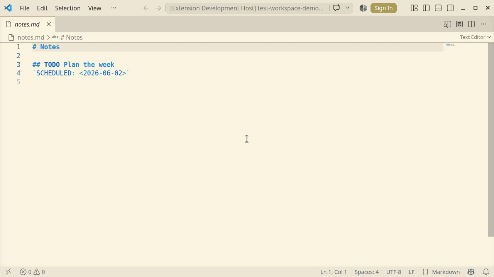
</picture>

### Linux: GNOME Online Accounts (no OAuth client)

On Linux you can skip the Google Cloud setup entirely and reuse a Google
account already configured in **GNOME Online Accounts** (GNOME Settings →
Online Accounts, with **Calendar** enabled). GNOME holds the OAuth
credentials and refreshes the token, so there is no `client_id` /
`client_secret` to manage and no test-client token expiry.

The source of the token is controlled by `markdown-org.gcalSync.authProvider`:

- `auto` (default) -- on Linux, use GNOME Online Accounts when a Google
  account is present there; otherwise fall back to the BYO OAuth flow above.
- `goa` -- always use GNOME Online Accounts (Linux only).
- `oauth` -- always use the BYO OAuth flow.

With a single GNOME Google account it is picked automatically. With several,
**Markdown Org: Connect Google Calendar** shows a picker and stores the
chosen email in `markdown-org.gcalSync.goaAccount`. Nothing is written to the
keychain in this mode -- GNOME owns the credentials. This path needs a session
DBus bus reachable from VS Code; where it is not (some remote / Flatpak
setups), `auto` falls back to the OAuth flow.

### Choosing the calendar

Run **Markdown Org: Select Google Calendar** to pick which calendar
receives the events; it pins the choice in
`markdown-org.gcalSync.calendarId`. With no pinned id, the sync finds
(or creates) a calendar named after `markdown-org.gcalSync.calendarName`.

<picture>
    <source media="(prefers-color-scheme: dark)" srcset="https://github.com/VitalyOstanin/markdown-org-vscode/raw/HEAD/media/demo-gcal-select-dark.gif">
    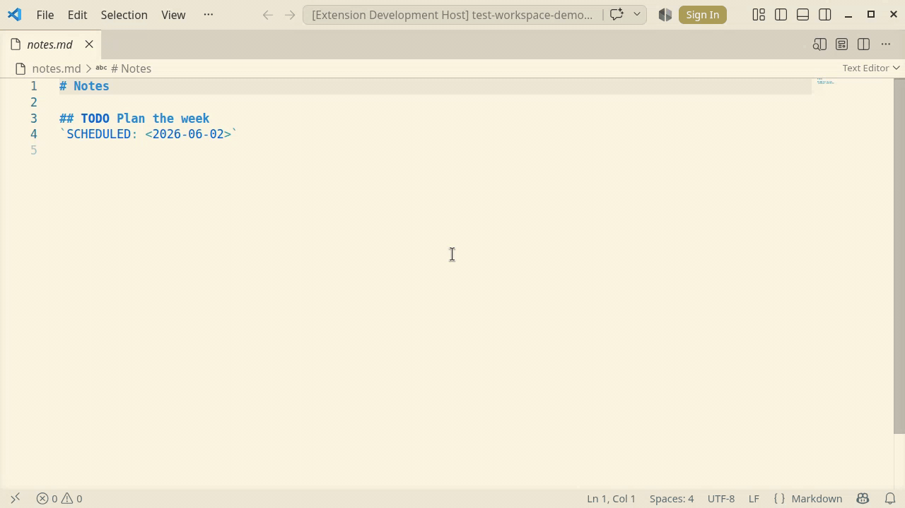
</picture>

### Running a sync

Two ways to trigger a sync:

- **Markdown Org: Sync Now (Google Calendar)** pushes once, on demand.
- The **sync-on-save** trigger (`markdown-org.gcalSync.syncOnSave`) runs a
  sync after you save a markdown file. It is **off by default**; when
  enabled, runs are debounced by
  `markdown-org.gcalSync.syncOnSaveDebounceMs` (5000 ms by default) so a
  burst of saves coalesces into one sync.

The two triggers differ in how they surface the result so that on-save
runs stay out of the way:

- **Sync Now** -- always shows the summary toast (you asked for it).
- **Sync on save** -- silent on success and "no changes"; a toast appears
  only when something failed (`failed > 0`), so a broken token or a
  network error is still visible. The status-bar spinner runs during
  every sync, and the **Calendar Sync** output channel keeps the full
  per-event log for both triggers.

Each sync extracts the tasks that carry an active `SCHEDULED` /
`DEADLINE` timestamp and pushes the corresponding events: a task with no
end time gets a timed event of `markdown-org.gcalSync.defaultEventMinutes`
duration (60 minutes by default). When a task becomes DONE, the
`markdown-org.gcalSync.onDone` setting decides whether to `delete` its
event or `keep` it. A CANCELLED task (either spelling) is always excluded
from the push and its event is deleted unconditionally, independent of
`onDone`.

### One sync at a time

Only one sync runs at a time:

- **Within one VS Code window**, requests that arrive while a sync is
  running are serialised per `markdown-org.gcalSync.concurrencyPolicy`:
  `queue` coalesces them into a single rerun, `cancel` aborts the
  in-flight run and restarts.
- **Across windows / processes**, a file lock in the workspace prevents a
  second sync from starting while another already holds it.

### Property write-back is deferred, never forced

To address an event by a stable key, the sync writes an `ID` (and the
returned `GCAL_EVENT_ID`) into the task's `org-properties` block. This
write-back is conflict-safe: if the target file currently has **unsaved
edits**, or has **shifted on disk since the tasks were extracted**, the
write is **deferred** rather than forced over your changes. Deferred
files are counted as `deferred` in the sync summary and retried on the
next sync. A task whose `ID` was freshly minted is **not published**
until that id is successfully written back, so a deferred write never
produces a duplicate event -- the same task reuses the same id on the
next run.

### Current limitations (MVP)

- **Push only.** Changes flow from your `.md` files to Google Calendar.
  Reverse sync (calendar -> markdown) is planned for a later phase.
- **No orphan cleanup.** Events left behind by tasks that were deleted
  outright (heading removed, not marked DONE) are not purged
  automatically.
- **Not every repeater becomes a recurring event.** Most do: `+Nd` / `+Nw` /
  `+Nm` / `+Ny` / `+Nh` map to `FREQ=DAILY|WEEKLY|MONTHLY|YEARLY|HOURLY` with
  `INTERVAL=N`, and `+1wd` to `FREQ=WEEKLY;BYDAY=MO,TU,WE,TH,FR` (needs the
  bundled extractor 0.10.0 or newer, which is where `timestamp_repeater` comes
  from). What has no single-rule form stays a one-shot event on its base date:
  `+Nwd` with `N > 1` ("every N-th workday"). The `+` / `++` / `.+` prefixes
  differ only in how org shifts the date on completion, which a calendar grid
  has no notion of, so they do not change the rule.
- **Second-window edits are invisible.** If the same file is open in a
  second VS Code window with unsaved edits, this extension cannot see
  that other window's in-memory state. A sync writing back to disk there
  may trigger VS Code's standard "file changed on disk" prompt in the
  other window.

### Settings

All Google Calendar sync settings live under the
`markdown-org.gcalSync.*` namespace:

| Setting                                      | Type                  | Default          | Description                                                                                                                                                     |
| -------------------------------------------- | --------------------- | ---------------- | --------------------------------------------------------------------------------------------------------------------------------------------------------------- |
| `markdown-org.gcalSync.clientId`             | `string`              | `""`             | Google OAuth Desktop `client_id` (BYO). The `client_secret` is entered on connect and kept in the OS keychain, not here. Scope `machine`.                       |
| `markdown-org.gcalSync.calendarName`         | `string`              | `"markdown-org"` | Name used to find-or-create the sync calendar when no `calendarId` is pinned.                                                                                   |
| `markdown-org.gcalSync.calendarId`           | `string`              | `""`             | Pinned Google calendar id (takes precedence over `calendarName`). Usually set by **Select Google Calendar**.                                                    |
| `markdown-org.gcalSync.concurrencyPolicy`    | `"queue" \| "cancel"` | `"queue"`        | Behaviour when a sync is requested while one is running (within a window): `queue` coalesces into a single rerun; `cancel` aborts the current run and restarts. |
| `markdown-org.gcalSync.syncOnSave`           | `boolean`             | `false`          | Run a (debounced) sync after saving a markdown file.                                                                                                            |
| `markdown-org.gcalSync.syncOnSaveDebounceMs` | `number`              | `5000`           | Debounce interval (ms) for the sync-on-save trigger.                                                                                                            |
| `markdown-org.gcalSync.onDone`               | `"delete" \| "keep"`  | `"delete"`       | When a task becomes DONE: `delete` removes its calendar event; `keep` leaves it.                                                                                |
| `markdown-org.gcalSync.defaultEventMinutes`  | `number`              | `60`             | Duration for a timed task event when no end time is given.                                                                                                      |

## Dependencies

The extension delegates markdown parsing to
[`markdown-org-extract`](https://crates.io/crates/markdown-org-extract) --
a Rust utility that scans `.md` files for headings, timestamps, and
CLOCK entries. The compiled binary for your platform is shipped inside
the VSIX, so there is nothing to install separately.

If you want to use a custom build (e.g. you are contributing to
markdown-org-extract or running with local patches), point
[`markdown-org.extractorPath`](#markdown-orgextractorpath) at your
binary. The setting is also useful in untrusted workspaces where the
bundled binary is disabled until you trust the workspace.

## Development

See [DEVELOPMENT.md](DEVELOPMENT.md) for build, test, debug, project
layout and release process.

## Release notes

Per-version changes are tracked in [`CHANGELOG.md`](CHANGELOG.md) using
the [Keep a Changelog](https://keepachangelog.com/en/1.1.0/) format.

## License

Released under the [MIT License](LICENSE) -- see the LICENSE file for the
full text. The `license` field in `package.json` carries the SPDX
identifier `MIT`.

The package also bundles the prebuilt `markdown-org-extract` binary, which
is a separate MIT-licensed work and is statically linked. Both notices ship
inside the VSIX next to the binary:

| №   | Path                                                | Covers                                      |
| --- | --------------------------------------------------- | ------------------------------------------- |
| 1   | `bin/LICENSE.markdown-org-extract`                  | the extractor's own code                    |
| 2   | `bin/THIRD-PARTY-LICENSES.markdown-org-extract.txt` | the crates linked into the extractor binary |

Both files are unpacked from the extractor's release archive at package
time rather than kept in this repository, so they always describe the
version actually shipped.
